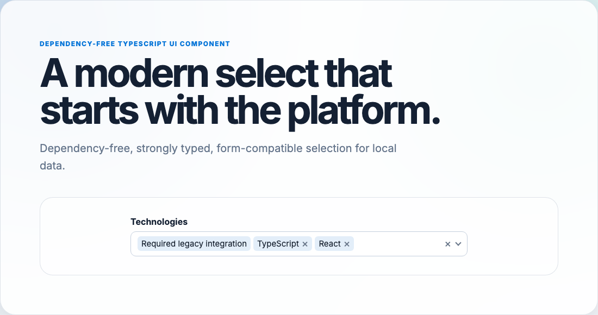

# customizable-select

An accessible, dependency-free TypeScript enhancement for native `<select>` and `<input>` elements. It provides searchable single and multiple selection, typed option metadata, native form integration, rendering hooks, and an optional React adapter.

`customizable-select` is a modern migration path from Select2, not a jQuery-compatible clone. The first release focuses on a reliable local-data core; remote data, pagination, tagging, and grouped options are deliberately reserved for future APIs.



## Features

- Enhances native inputs and selects without replacing their form semantics.
- Single and multiple selection with disabled and locked options.
- Diacritic-insensitive local search and complete keyboard navigation.
- Typed metadata, events, filters, and rendering hooks.
- Configurable parsing and serialization for input-backed values.
- Deterministic source synchronization and teardown restoration.
- Optional controlled or uncontrolled React adapter.
- Scoped CSS tokens with no JavaScript runtime dependencies.

## Install

```bash
npm install customizable-select
```

Import the stylesheet once:

```ts
import 'customizable-select/styles.css';
```

## Native Select

```html
<label for="framework">Framework</label>
<select id="framework" name="framework"></select>
```

```ts
import {CustomizableSelect, type CustomizableSelectOption} from 'customizable-select';

type FrameworkData = {homepage: string};

const options: CustomizableSelectOption<FrameworkData>[] = [
	{id: 'react', text: 'React', data: {homepage: 'https://react.dev'}},
	{id: 'vue', text: 'Vue', data: {homepage: 'https://vuejs.org'}},
];

const select = new CustomizableSelect<FrameworkData>(document.querySelector('#framework')!, {
	options,
	placeholder: 'Choose a framework',
});

select.setValue('react');
console.log(select.getValue()); // "react"
console.log(select.getSelectedOptions()[0]?.data?.homepage);
```

The source element remains in the form and receives the selected value. User changes dispatch its normal bubbling `change` event.

## Multiple Input

Inputs use comma-separated values by default. Supply parser and serializer functions when IDs can contain commas or another wire format is required.

```ts
const input = document.querySelector<HTMLInputElement>('#recipients')!;
const recipients = new CustomizableSelect(input, {
	options: users,
	multiple: true,
	parseInputValue: (value) => (value === '' ? [] : value.split('|')),
	serializeInputValue: (values) => values.join('|'),
});
```

## Events

Use the typed instance API for component events and the source element for native form events:

```ts
select.addEventListener('customizable-select:change', ({detail}) => {
	console.log(detail.value, detail.values, detail.selectedOptions, detail.userInitiated);
});
```

Events include `customizable-select:open`, `:close`, `:select`, `:unselect`, `:clear`, and `:change`.

Programmatic `setValue()` calls are silent by default:

```ts
select.setValue('vue', {dispatchChange: true});
```

## React

```tsx
import {useState} from 'react';
import {CustomizableSelect} from 'customizable-select/react';
import 'customizable-select/styles.css';

export function FrameworkField() {
	const [value, setValue] = useState<string | null>('react');

	return (
		<CustomizableSelect
			name="framework"
			options={options}
			value={value}
			onValueChange={({value: nextValue}) => setValue(typeof nextValue === 'string' ? nextValue : null)}
		/>
	);
}
```

Use `defaultValue` for uncontrolled operation and `sourceElement="input"` for input serialization.

## API Summary

- `open()`, `close()`, `focus()`
- `setOptions()`, `getOptions()`
- `setValue()`, `getValue()`, `getValues()`, `getValueString()`
- `setSelectedOptions()`, `getSelectedOptions()`
- `setMultiple()`, `setDisabled()`, `setReadOnly()`
- `destroy()`
- `createCustomizableSelect()`, `getCustomizableSelect()`, `destroyCustomizableSelect()`

Read the [complete guide](./docs/guide.md) for option semantics, accessibility, styling, lifecycle behavior, and Select2 migration guidance. Generated declarations and TypeDoc output are the authoritative API reference.

## Development

```bash
pnpm install
pnpm run ci
pnpm run integration-test
```
